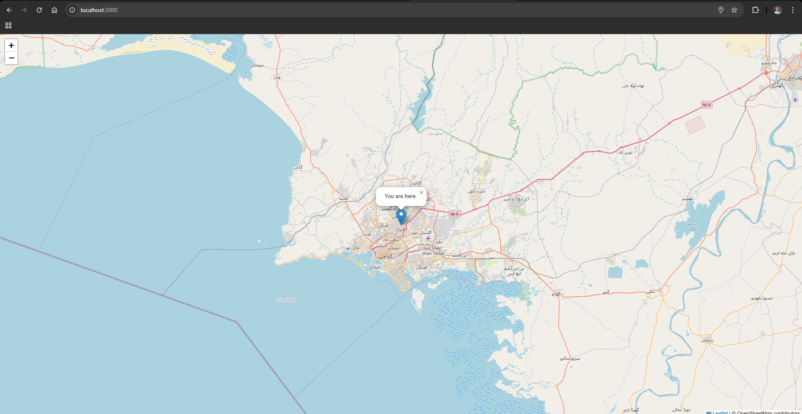

# 🌍 Real-Time Location Tracking Web App

This project enables **live location sharing** on an interactive map using **Socket.io** and **Leaflet.js**. Multiple users can view and track each other’s locations in real time. 🚀

## 📌 Features
- **Real-time location sharing** using WebSockets
- **Custom map markers** with user IDs
- **Live updates** with `watchPosition()`
- **Interactive UI** powered by Leaflet.js
- **Cross-device compatibility**
- **Secure connections** with Helmet.js

## 🛠️ Tech Stack
- **Frontend:** HTML, CSS, JavaScript, Leaflet.js
- **Backend:** Node.js, Express.js, Socket.io
- **API & Services:** Geolocation API, OpenStreetMap
- **Security:** Helmet.js, CSP policies

## 📡 How It Works
1. Users connect to the server via WebSockets.
2. Their **live location** is shared and updated in real time.
3. Locations are displayed using **Leaflet.js** with custom markers.
4. Users can see other active users on the map.

